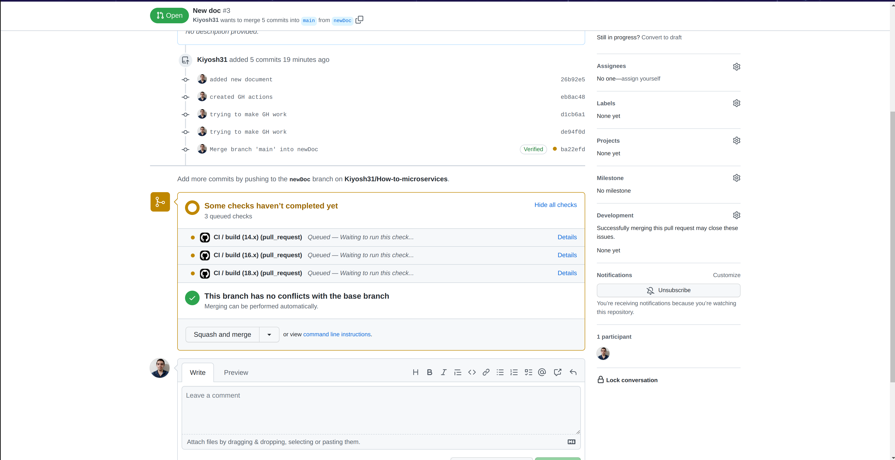
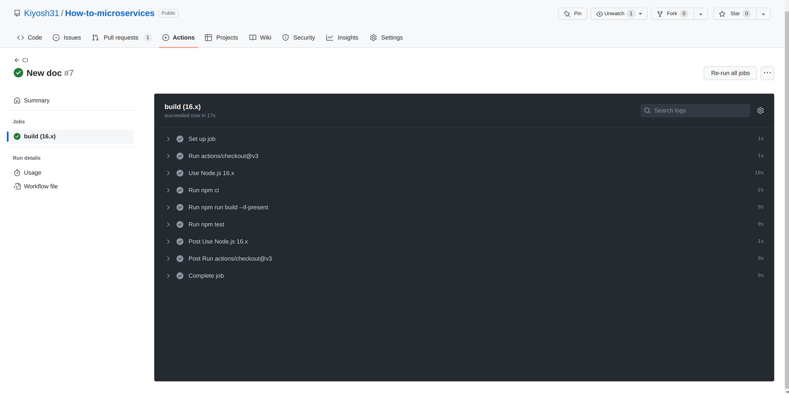
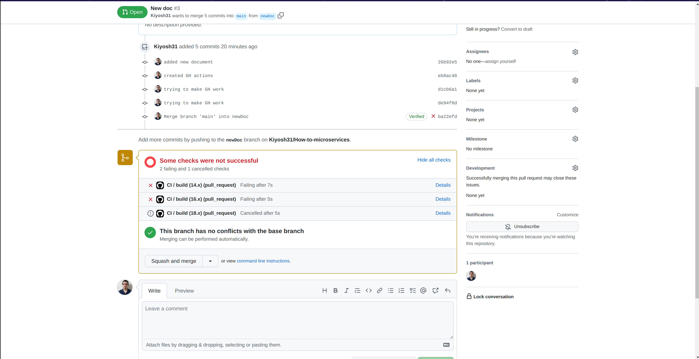

# Introduction

This part is to perform some type of build before merging a PR into master, this is for `devs` and `QA` to know the new feature/code is build successfully without errors

# Instructions

Go to your `Actions` tab in your repo, and then select the technology you need to perform this build, this will generate a folder and a `.yml file` inside of your project this is needed and you cand modify it as you want

I will add some node.js code to this project only for showcase purposes

# Showcase

So now everything must be setup, now when we raise a PR, we will see this

## Success case

## Faile case

